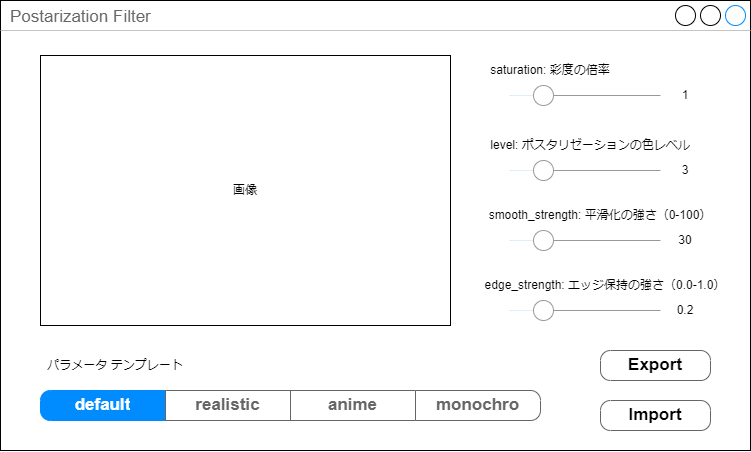

# 仕様

main.pyのconvert_to_anime_style関数をGUIでインタラクティブに確認しながらパラメータ調整が行えるアプリを作りたい

## 画面イメージ

- パラメータテンプレートはmain.pyのPARAMETER_SETSのパラメータに基づく
  - 画面イメージ右側の各パラメータもそれに追従すること
- importでダイアログウィンドウが開き、ローカルの画像から画像を選ぶと、画面イメージの画像に反映され、右の4つのパラメータでインタラクティブに画像の加工が行え、いい感じになったらExportでjpegに出力したい
- 右の各種パラメータはconvert_to_anime_styleの各種パラメータに対応すること
